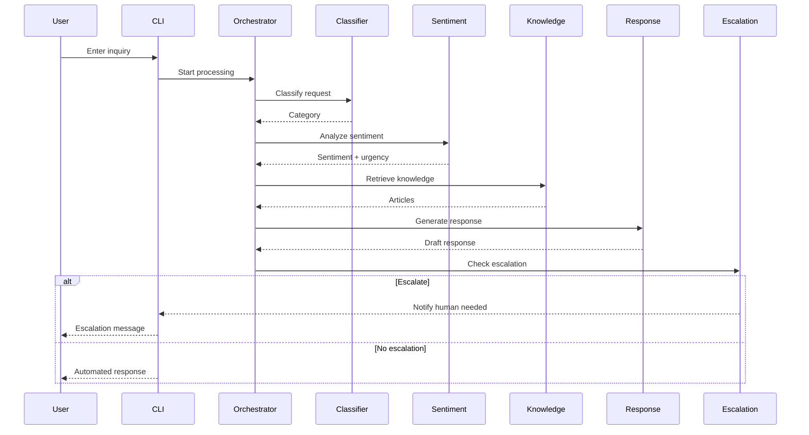

# Solution Architecture Document: Multi-Agent Customer Support Crew (MVP)

## Architecture Overview

The Multi-Agent Customer Support Crew MVP is a simple, locally-executable Python application that demonstrates the concept of multi-agent customer support. The system uses CrewAI to orchestrate a sequence of specialized agents that process customer inquiries sequentially. This streamlined architecture focuses on core functionality for a 6-week capstone project.

### High-Level Architecture

```
[CLI/Text Interface] --> [CrewAI Orchestrator] --> [Sequential Agent Execution]
                              |
                              v
                    [Markdown/JSON Knowledge Base]
                              ^
                              |
                    [Human Escalation (Console Output)]
```

**Key Components:**
- **CLI/Text Interface**: Simple command-line interface for submitting customer inquiries and viewing responses.
- **CrewAI Orchestrator**: Local orchestrator that manages sequential execution of agents.
- **Agent Pool**: Five specialized agents (Classifier, Sentiment, Knowledge, Response, Escalation) executed in order.
- **Knowledge Base**: Local markdown and JSON files containing support articles and FAQs.
- **Human Escalation**: Console-based notification for cases requiring human intervention.

### Design Principles
- **Simplicity**: Focus on core multi-agent workflow with minimal complexity.
- **Locality**: All components run locally without external dependencies.
- **Sequential Execution**: Agents process requests one after another for predictable behavior.
- **Modularity**: Agents are separate classes for easy development and testing.
- **Iterative Development**: Designed for rapid prototyping and refinement over 6 weeks.

## Agent Design

Agents are implemented as CrewAI agents with standardized interfaces, allowing for easy integration within the sequential workflow.

### Agent Interface (CrewAI-based)
```python
from crewai import Agent

class SupportAgent(Agent):
    def execute_task(self, task_input: str) -> str:
        """Execute agent-specific task and return results"""
        pass
```

### Agent Implementations

1. **ClassifierAgent**
   - **Role**: Categorize customer inquiries using keyword matching.
   - **Implementation**: Simple rule-based classification with predefined categories.
   - **Output**: Category string with basic confidence indicator.

2. **SentimentAnalysisAgent**
   - **Role**: Detect emotional tone in customer messages.
   - **Implementation**: Basic positive/negative word counting.
   - **Output**: Sentiment label (positive/negative/neutral) with urgency flag.

3. **KnowledgeRetrievalAgent**
   - **Role**: Find relevant information from the knowledge base.
   - **Implementation**: Text search through markdown/JSON files.
   - **Output**: Relevant article excerpts or "no match found".

4. **ResponseGenerationAgent**
   - **Role**: Create appropriate responses based on gathered information.
   - **Implementation**: Template-based response generation.
   - **Output**: Formatted response text.

5. **EscalationAgent**
   - **Role**: Determine if human intervention is needed.
   - **Implementation**: Rule-based decision using confidence scores and sentiment.
   - **Output**: Boolean escalation flag with reason.

### Agent Execution
Agents are executed sequentially by the CrewAI orchestrator:
1. Classifier processes the input
2. Sentiment analyzes the message
3. Knowledge retrieves relevant info
4. Response generates a draft
5. Escalation decides on human involvement

Results from each agent are passed as context to the next agent.

## System Flow

### Request Processing Flow



### Key Workflows
1. **Standard Processing**: Sequential execution through all agents for automated response.
2. **Escalation Path**: If escalation agent determines human needed, display notification.
3. **Knowledge Update**: Manual process for updating markdown/JSON files (future enhancement).

## Tech Stack

### Core Technologies
- **Language**: Python 3.9+
- **Framework**: CrewAI for multi-agent orchestration
- **Knowledge Base**: Local markdown files and JSON for data storage
- **Interface**: Python CLI using argparse or simple input/output

### Libraries and Tools
- **NLP Processing**: Basic string operations (expandable to NLTK if time permits)
- **File Handling**: Python's built-in json and file I/O for knowledge base
- **Testing**: Pytest for unit tests on individual agents
- **Logging**: Python logging for basic debugging

### Development Environment
- **IDE**: VS Code with Python extensions
- **Version Control**: Git for code management
- **Documentation**: Inline code comments and simple README

## MVP Scope

### 6-Week Development Timeline

**Week 1-2: Foundation**
- Set up project structure with CrewAI
- Implement basic agent classes and interfaces
- Create sample knowledge base (markdown/JSON)
- Build simple CLI interface

**Week 3-4: Core Agents**
- Develop ClassifierAgent with rule-based logic
- Implement SentimentAnalysisAgent
- Build KnowledgeRetrievalAgent
- Create ResponseGenerationAgent

**Week 5: Integration**
- Implement EscalationAgent
- Integrate all agents in sequential workflow
- Add basic error handling and logging

**Week 6: Testing & Polish**
- Unit tests for each agent
- End-to-end testing of complete workflow
- Documentation and demo preparation

### Core Components
- Five functional agents with basic rule-based logic
- Sequential execution orchestrated by CrewAI
- CLI interface for input/output
- Local markdown/JSON knowledge base with sample data
- Console-based escalation notifications

### MVP Constraints
- Single-user, single-threaded execution
- Hardcoded agent configurations
- Basic error handling (exceptions logged to console)
- No persistence of conversation history
- Manual knowledge base updates

### MVP Deliverables
- Functional CLI application
- All agent classes with unit tests
- Sample knowledge base files
- Basic documentation (README, code comments)
- Demo script for showcasing functionality

### MVP Success Criteria
- Process basic customer inquiries end-to-end
- Demonstrate multi-agent collaboration
- Handle escalation scenarios appropriately
- Code is readable and maintainable
- Project can be run locally with `python main.py`

## Out of Scope / Future Enhancements

### Advanced Architecture
- API Gateway for web interfaces
- Microservices architecture
- Event-driven communication
- Distributed agent execution

### User Interfaces
- Web dashboards (Streamlit or similar)
- Real-time chat interfaces
- Mobile applications
- Admin configuration panels

### Data & Analytics
- Analytics Engine for metrics collection
- Database integration (SQL/NoSQL)
- Automated reporting
- Performance monitoring

### Scalability & Production
- Docker containerization
- Kubernetes orchestration
- CI/CD pipelines
- Production deployment configurations
- Load balancing and high availability

### Advanced Features
- Machine learning models for agents
- Multi-language support
- Voice/video processing
- Integration with external systems (CRM, email)
- Advanced security and authentication
- Automated knowledge base updates

### Development Tools
- Advanced testing frameworks
- Code quality tools (linting, formatting)
- Comprehensive documentation systems
- Monitoring and alerting

This simplified architecture focuses on demonstrating the multi-agent concept within the constraints of a 6-week capstone project, providing a solid foundation for future enhancements.